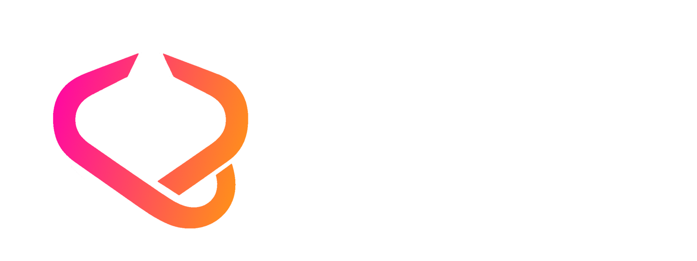

<p align="center">
  
</p>

FusionRouter is a navigation library for Roblox UI built with Fusion.

It provides screens, modals, overlays, route params, lifecycle hooks, retention, and transitions.

## Installation

FusionRouter is still in early development, but you can install it by cloning the repository and using it as a local package in your Roblox project.

## Quick Start

```lua
local Fusion = require(path.to.fusion)
local Router = require(path.to.fusionRouter)

local router = Router.create({
    screens = {
        MainMenu = Router.screen(MainMenu),
        Inventory = Router.screen(Inventory),
        Shop = Router.screen(Shop),
    },

    modals = {
        ItemDetails = Router.modal(ItemDetails),
    },
}, Fusion)
```

## Navigation

```lua
router:push("Inventory", {
    category = "Weapons",
})

router:replace("Shop")
router:back()
router:reset("MainMenu")
```

## Modals

```lua
router:pushModal("ItemDetails", {
    itemId = "sword_01",
})

router:popModal()
router:closeAllModals()
```

Inside a route context:

```lua
ctx.close()
```

## Route Params

Pass params when navigating:

```lua
router:push("Inventory", {
    category = "Weapons",
})
```

Read them inside a route:

```lua
local function Inventory(ctx)
    print(ctx.params.category)
end
```

## Retention

Screen retention controls what happens when leaving a screen.

* `destroy` — unmount the screen when it is left
* `keepAlive` — keep the screen mounted and preserve its state
* `singleton` — reuse one persistent screen instance

```lua
Inventory = Router.screen(Inventory, {
    retention = "keepAlive",
})
```

## Lifecycle Hooks

```lua
Inventory = Router.screen(Inventory, {
    onEnter = function(ctx)
        print("entered inventory")
    end,

    onExit = function(ctx)
        print("left inventory")
    end,

    onPause = function(ctx)
        print("inventory hidden")
    end,

    onResume = function(ctx)
        print("inventory resumed")
    end,
})
```

## Transitions

```lua
local router = Router.create({
    transitions = {
        screenPush = "slideLeft",
        screenPop = "slideRight",
        modalOpen = "fadeScaleIn",
        modalClose = "fadeOut",
    },

    screens = {
        MainMenu = Router.screen(MainMenu),
    },
}, Fusion)
```

## Route Options

### `Router.screen(component, options?)`

* `retention`
* `enterTransition`
* `exitTransition`
* `canEnter`
* `canExit`
* `onEnter`
* `onExit`
* `onPause`
* `onResume`
* `validateParams`

### `Router.modal(component, options?)`

* `transition`
* `barrierDismiss`
* `canEnter`
* `canExit`
* `onEnter`
* `onExit`
* `validateParams`

### `Router.overlay(component, options?)`

* `persistent`
* `visible`
* `onEnter`
* `onExit`

## License

MIT License. See [LICENSE](./LICENSE) for details.
